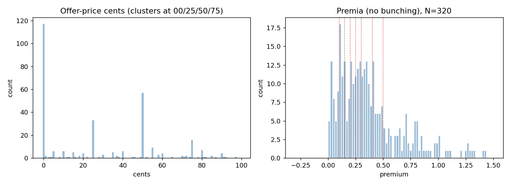

# ma-premium-bunching

Do acquisition premia bunch at round numbers the way merger offer prices do?

This repo tests whether the well-documented round-number clustering in merger offer prices carries over to the premium, the percentage paid over the target's unaffected price. The premium is the cleaner behavioral object: an offer price can be round for mechanical reasons, whereas a round premium would reflect a deliberate choice about the size of the markup.

The method runs end to end on a synthetic dataset that ships with the repo, so it reproduces with no vendor access. On real data the deal list comes from SEC EDGAR (free) and prices come from LSEG (licensed, not redistributed).

## Result

On 320 completed cash acquisitions of US public companies (2010 to 2025): offer prices cluster strongly at round numbers (36.6 percent end in .00, 69.7 percent sit on a quarter-dollar), but acquisition premia do not bunch (21.4 percent fall on a 5 percent multiple, against 20 percent by chance, p = 0.28; the excess-mass estimator is zero at every focal premium). The only premium roundness sits in the few deals whose pre-bid price is also round, and it vanishes once the pre-bid price is not round, so it is mechanical inheritance from round prices, not negotiators targeting round premia. The focal point is the price a bidder names, not the premium it implies. Full write-up: [docs/paper.md](docs/paper.md).



## What the method does

1. Bunching: a Chetty et al. (2011) polynomial excess-mass estimator on the premium distribution, with a bootstrap standard error.
2. Spine test: the premium must still bunch after conditioning on a non-round pre-bid price. If the spike is only mechanical inheritance from round prices, the result collapses, so this test decides whether there is a headline or a null.
3. Outcome design: a local-linear regression discontinuity at the round-premium threshold, recovering the jump in completion probability and announcement returns.

## Layout

```
ma-premium-bunching/
  src/
    clustering_tests.py  offer-price clustering + the spine test (main result)
    bunching.py          Chetty-polynomial excess-mass estimator + bootstrap
    rdd.py               local-linear sharp RDD with triangular kernel
    event_study.py       market-model CARs from a returns panel
    make_synthetic.py    generator with known bunching and a known RDD jump
    run_pipeline.py      end-to-end analysis (real data if present, else synthetic)
    edgar_deals.py       SEC EDGAR deal extractor (target completion 8-Ks)
    edgar_tickers.py     fill historical target tickers from announcement filings
    lseg_extract.py      LSEG Deals-screen extractor (optional, entitlement-capped)
    lseg_prices.py       price join: deal list -> premium, p0 (the contract)
  docs/
    paper.md                   the short paper (result and method)
    figures/                   committed result figures
    methodology.md             research design, data-pull and analysis plan
    data_provenance.md         sources, licensing, how the premium is built
    research_log.md            decisions, dead ends, data-quality findings
    lseg_excel_extraction.md   LSEG Excel deal-screen notes
    excel_price_pull_prompt.md LSEG Excel price-pull prompt (reliable channel)
  data/                empty in git; deal lists and prices land here (ignored)
  outputs/             generated figures and tables (ignored)
  requirements.txt
  LICENSE
```

## Quick start (synthetic, no vendor access)

```
pip install -r requirements.txt
cd src
python run_pipeline.py
```

It reports a positive normalized excess mass `b` at each focal premium, bunching that survives the non-round-price condition, and recovered outcome jumps. Each module also self-checks when run directly (`python bunching.py`, `python rdd.py`, `python event_study.py`).

## Real data

Three stages, all resumable.

1. Deal list (free): set your contact email in `edgar_deals.py` (`EDGAR_UA`), run `python edgar_deals.py` (target completion 8-Ks), then `python edgar_tickers.py` to fill historical target tickers from the announcement filings.
2. Price join: `python lseg_prices.py` resolves each target to its delisted RIC, confirms identity by matching the name, and computes the premium from the offer over the unaffected close about a month before announcement, writing `data/deals_enriched.csv`. Needs an LSEG entitlement; the Excel route in `docs/excel_price_pull_prompt.md` is the reliable channel when the Python desktop API is flaky.
3. Analyse: `python clustering_tests.py` runs the offer-price clustering and the spine test (the main result), and `python run_pipeline.py` runs the bunching estimator. Both read `data/deals_enriched.csv`.

The analysis needs `premium`, `p0`, and `p0_is_round`; the premium is the offer over the unaffected close about one month before announcement. See `docs/data_provenance.md`.

## Honest limitations

The sample is 320 completed cash deals. Withdrawn deals are absent, so the completion-outcome test is not run here. Identifying delisted targets causes attrition (about 120 deals dropped for successor-name mismatches, recoverable by whitelist), and prices come from one vendor. The offer-price clustering and the main premium null are well powered; the round-pre-bid-price cell is small. Full limitations and the data-acquisition journey, including the LSEG quota wall and the fixes, are in `docs/paper.md` and `docs/research_log.md`.

## References

Chetty, Friedman, Olsen, Pistaferri (2011), bunching estimator. Huang et al. (2023) and Du et al. (2020), price clustering in M&A. Pope et al. (2015), round-number focal points in bargaining. Full list in `docs/paper.md`.
